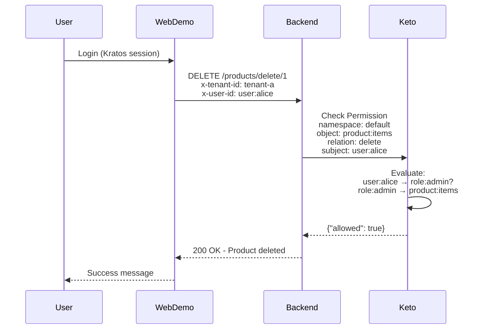
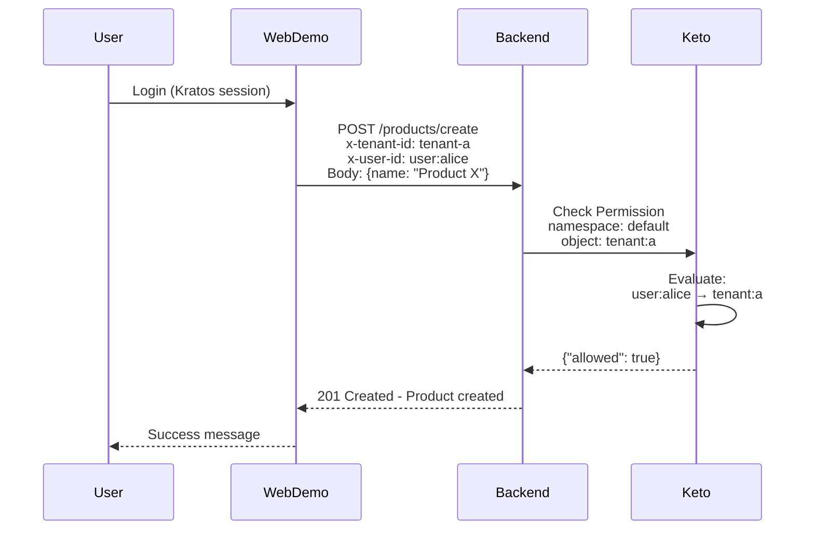
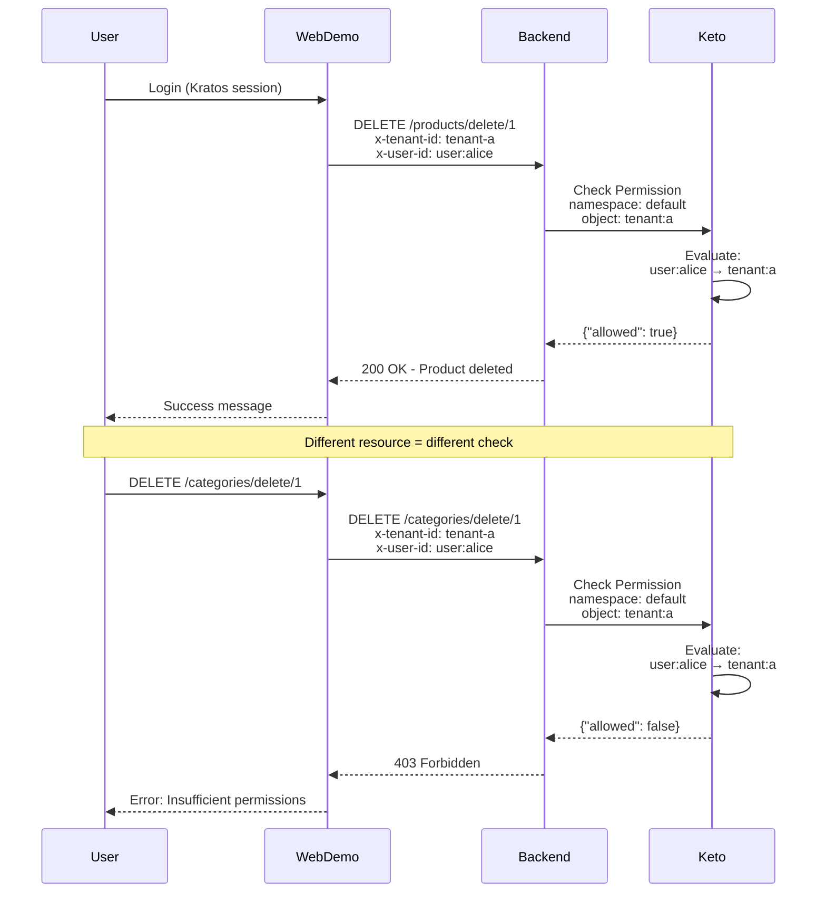

# Web Demo Architecture Documentation

## Table of Contents

- [Executive Summary](#executive-summary)
- [System Context](#system-context)
- [Architecture Overview](#architecture-overview)
- [Use Case Implementations](#use-case-implementations)
- [Component Architecture](#component-architecture)
- [API Contracts](#api-contracts)
- [Data Architecture](#data-architecture)
- [Authorization Flows](#authorization-flows)
- [Integration Patterns](#integration-patterns)
- [Deployment Architecture](#deployment-architecture)
- [Security Architecture](#security-architecture)
- [Architecture Decision Records](#architecture-decision-records)

---

## Executive Summary

The Web Demo is a **Next.js-based web application** that serves as a comprehensive demonstration of three distinct authorization models using the Ory Stack (Kratos, Keto, Oathkeeper). It provides a unified web interface for managing users, products, and categories across different RBAC (Role-Based Access Control) implementations.

### Key Characteristics

- **Framework**: Next.js (client-side rendering only)
- **API Gateway**: Ory Oathkeeper (single entry point for all requests)
- **Backend Integration**: Multi-tenancy Demo API (Express.js on port 9000)
- **Authorization Models**: 3 distinct RBAC approaches
- **Core Resources**: Users, Products, Categories
- **Authentication**: Ory Kratos (session-based)
- **Authorization**: Ory Keto (permission checks via Oathkeeper)

---

## System Context

### C4 Level 1: System Context Diagram

```
┌─────────────────────────────────────────────────────────────────────┐
│                         External Systems                            │
├─────────────────────────────────────────────────────────────────────┤
│                                                                     │
│   ┌──────────────┐                                                 │
│   │   End User   │                                                 │
│   │  (Browser)   │                                                 │
│   └──────┬───────┘                                                 │
│          │                                                          │
│          │ HTTPS (Port 3000)                                       │
│          ▼                                                          │
│   ┌──────────────────────────────────────────────┐                │
│   │        Web Demo (Next.js)                    │                │
│   │  ┌──────────────────────────────────────┐   │                │
│   │  │  Use Case 1: Simple RBAC             │   │                │
│   │  │  Use Case 2: Tenant-Centric RBAC     │   │                │
│   │  │  Use Case 3: Resource-Scoped RBAC    │   │                │
│   │  └──────────────────────────────────────┘   │                │
│   └───────────────────┬──────────────────────────┘                │
│                       │                                            │
│                       │ HTTP (Port 4455 - API Gateway)            │
│                       ▼                                            │
│   ┌──────────────────────────────────────────────┐                │
│   │         Oathkeeper (API Gateway)             │                │
│   │  ┌──────────────────────────────────────┐   │                │
│   │  │ Authenticator → Authorizer → Mutator │   │                │
│   │  └──────────────────────────────────────┘   │                │
│   └───────────────────┬──────────────────────────┘                │
│                       │                                            │
│          ┌────────────┼────────────┐                              │
│          │            │            │                              │
│          ▼            ▼            ▼                              │
│   ┌──────────┐  ┌─────────┐  ┌──────────────────┐               │
│   │  Kratos  │  │  Keto   │  │ Multi-Tenancy    │               │
│   │  (Auth)  │  │ (Authz) │  │ Demo Backend     │               │
│   │ :4433/34 │  │:4466/67 │  │ (Express - 9000) │               │
│   └────┬─────┘  └────┬────┘  └──────────────────┘               │
│        │             │        (In-Memory Store)                   │
│        │             │                                            │
│        └─────┬───────┘                                            │
│              │                                                     │
│              ▼                                                     │
│        ┌──────────┐                                               │
│        │PostgreSQL│                                               │
│        │  :5432   │                                               │
│        └──────────┘                                               │
│        (Kratos & Keto Data Only)                                  │
│                                                                     │
└─────────────────────────────────────────────────────────────────────┘
```

### System Boundaries

**Internal Systems:**
- Web Demo (Next.js application)
- Ory Oathkeeper (API Gateway)
- Ory Kratos (Identity & Authentication)
- Ory Keto (Authorization)
- Multi-Tenancy Demo Backend (Express.js API)
- PostgreSQL (Ory services data persistence only)

**External Actors:**
- End Users (web browsers)
- System Administrators (managing roles and permissions)

### System Responsibilities

| Component | Responsibility |
|-----------|----------------|
| **Web Demo** | User interface, use case demonstration, single API endpoint (Oathkeeper) |
| **Oathkeeper** | API gateway, authentication verification, authorization enforcement, request routing |
| **Kratos** | User authentication, identity management, session handling |
| **Keto** | Authorization decisions, permission management, RBAC enforcement |
| **Backend API** | Business logic, in-memory data storage (users, products, categories) |
| **PostgreSQL** | Data persistence for Kratos (identities, sessions) and Keto (relation tuples) only |

---

## Architecture Overview

### High-Level Architecture Pattern

The Web Demo follows a **layered architecture** with clear separation of concerns:

```
┌─────────────────────────────────────────────────────────────┐
│  Presentation Layer (Next.js - Port 3000)                   │
│  ┌─────────────┐  ┌─────────────┐  ┌─────────────┐        │
│  │ Use Case 1  │  │ Use Case 2  │  │ Use Case 3  │        │
│  │ Simple RBAC │  │ Tenant RBAC │  │ Resource    │        │
│  └─────────────┘  └─────────────┘  └─────────────┘        │
└─────────────────────────────────────────────────────────────┘
                          │
                          │ HTTP (Port 4455)
                          ▼
┌─────────────────────────────────────────────────────────────┐
│  API Gateway Layer (Oathkeeper - Port 4455)                 │
│  ┌──────────────────────────────────────────────────┐     │
│  │  Access Rules Pipeline:                          │     │
│  │  1. Authenticator (cookie_session/bearer_token)  │     │
│  │  2. Authorizer (keto_engine_acp_ory)             │     │
│  │  3. Mutator (header injection)                   │     │
│  │  4. Upstream proxy                               │     │
│  └──────────────────────────────────────────────────┘     │
└─────────────────────────────────────────────────────────────┘
                          │
         ┌────────────────┼────────────────┐
         │                │                │
         ▼                ▼                ▼
┌──────────────┐  ┌──────────────┐  ┌──────────────────────┐
│   Kratos     │  │     Keto     │  │ Multi-Tenancy Demo   │
│ (Identity)   │  │ (Authorization)│ │ Backend (Port 9000)  │
│ :4433/34     │  │  :4466/67    │  │  ┌────────────────┐  │
└──────┬───────┘  └──────┬───────┘  │  │ Users Router   │  │
       │                 │           │  │ Product Router │  │
       │                 │           │  │ Category Router│  │
       └────────┬────────┘           │  └────────────────┘  │
                │                    │  (In-Memory Store)   │
                ▼                    └──────────────────────┘
         ┌──────────────┐
         │  PostgreSQL  │
         │    :5432     │
         │ (Kratos &    │
         │  Keto Only)  │
         └──────────────┘
```

### Architectural Principles

1. **API Gateway Pattern**: All requests routed through Oathkeeper (single entry point)
2. **Zero Trust Security**: Authentication and authorization enforced at gateway layer
3. **Separation of Concerns**: Each layer has a distinct responsibility
4. **Multi-Tenancy by Design**: Tenant context propagated through all layers
5. **Pluggable Authorization**: Support for multiple RBAC models
6. **Stateless Services**: All services are horizontally scalable
7. **In-Memory Demo Data**: Backend uses in-memory storage (not PostgreSQL)

---

## Use Case Implementations

The Web Demo demonstrates **three distinct authorization approaches**, each with increasing complexity and flexibility.

### Use Case 1: Simple RBAC

**Reference**: `keto-zanziban-simple-rbac/README.md`

#### Architecture Pattern

```
user:alice → role:admin → product:items (delete permission)
                        → category:items (create permission)
```

#### Characteristics

- ✅ **Single namespace** (`default`)
- ✅ **Global roles** (admin, moderator, customer)
- ✅ **Hierarchical inheritance** (admin → moderator → customer)
- ✅ **No tenant isolation** - roles apply across all tenants
- ✅ **Simple permission model** - one role per user

#### Components

| Component | Purpose |
|-----------|---------|
| **Role Management** | CRUD operations for roles (admin, moderator, customer) |
| **User Management** | User creation with Kratos identity + Keto role assignment |
| **Permission Assignment** | Link roles to resource actions (view, create, delete) |

#### Data Flow

```
1. User logs in → Kratos creates session
2. User assigned role → Keto stores relation (user:alice → role:admin)
3. User performs action → Keto checks permission
4. Keto evaluates: user → role → resource → action
5. Backend receives authorization decision (allowed/denied)
```

#### Role Hierarchy

```
admin (highest)
  ├─ delete products
  ├─ create categories
  └─ inherits all moderator permissions
      ├─ create products
      ├─ update categories
      └─ inherits all customer permissions
          ├─ view products
          └─ view categories
```

---

### Use Case 2: Keto Zanzibar Multi-Tenancy RBAC (Tenant-Centric)

**Reference**: `keto-zanzibar-multi-tenancy-rbac/README.md`

#### Architecture Pattern

```
user:alice → tenant:a (as admin) → tenant:a#product:items (create permission)
user:alice → tenant:b (as customer) → tenant:b#product:items (view permission)
```

#### Characteristics

- ✅ **Tenant isolation** - complete separation between tenants
- ✅ **Multi-tenant users** - same user, different roles per tenant
- ✅ **Tenant-scoped roles** - one role per tenant per user
- ✅ **Single namespace** (`default`) with tenant prefixes
- ✅ **Flexible hierarchies** - each tenant defines own structure

#### Components

| Component | Purpose |
|-----------|---------|
| **Tenant Management** | CRUD for tenant entities (tenant:a, tenant:b) |
| **Role Management** | Assign roles per tenant (Alice = admin in Tenant A, customer in Tenant B) |
| **User Management** | Multi-tenant user onboarding with Kratos + per-tenant role assignment |
| **Resource Isolation** | Enforce tenant boundaries in queries |

#### Data Flow

```
1. Request includes x-tenant-id header → Context middleware extracts tenant
2. User identity retrieved from Kratos session
3. Keto checks: user → tenant → role → resource → action
4. Example: user:alice → tenant:a#admin → tenant:a#product:items → create
5. Backend receives tenant-scoped authorization decision
```

#### Multi-Tenant User Example: Alice

**Tenant A:**
- Role: **Admin**
- Permissions: All operations on products and categories

**Tenant B:**
- Role: **Customer**
- Permissions: View-only on products and categories

```
Check: Can Alice delete products in Tenant A?
Query: user:alice → tenant:a#admin → tenant:a#product:items → delete
Result: ✅ Allowed (admin role in Tenant A)

Check: Can Alice delete products in Tenant B?
Query: user:alice → tenant:b#customer → tenant:b#product:items → delete
Result: ❌ Denied (customer role in Tenant B)
```

---

### Use Case 3: Keto Multi-Tenant Resource-Scoped RBAC

**Reference**: `keto-zanziban-multi-tenancy-rbac-per-resource/README.md`

#### Architecture Pattern

```
user:alice → tenant:a#product:items (as admin)    → delete products allowed
user:alice → tenant:a#category:items (as moderator) → delete categories denied
```

#### Characteristics

- ✅ **Resource-level roles** - different roles per resource type
- ✅ **Maximum granularity** - Alice = admin for products, moderator for categories
- ✅ **Tenant isolation** - per-resource, per-tenant
- ✅ **Complex permission matrix** - N users × M tenants × R resources
- ⚠️ **Higher complexity** - more relation tuples to manage

#### Components

| Component | Purpose |
|-----------|---------|
| **Tenant Management** | Create tenant contexts |
| **Role Management** | Assign roles **per resource type** (Alice = admin for products, moderator for categories) |
| **User Management** | Multi-resource user onboarding |
| **Resource-Specific Authorization** | Check permissions at resource granularity |

#### Data Flow

```
1. Request includes x-tenant-id + resource type (product/category)
2. Keto checks: user → tenant#resource → role → action
3. Example: user:alice → tenant:a#product:items → admin → delete
4. Example: user:alice → tenant:a#category:items → moderator → delete (DENIED)
5. Backend receives resource-scoped authorization decision
```

#### Resource-Scoped Role Example: Alice in Tenant A

**Products:**
- Role: **Admin**
- Permissions: view, create, delete

**Categories:**
- Role: **Moderator**
- Permissions: view, update (NO create/delete)

```
Check: Can Alice delete products in Tenant A?
Query: user:alice → tenant:a#product:items → admin → delete
Result: ✅ Allowed (admin role for products)

Check: Can Alice create categories in Tenant A?
Query: user:alice → tenant:a#category:items → moderator → create
Result: ❌ Denied (moderator role - create is admin-only)
```

---

## Component Architecture

### C4 Level 2: Container Diagram

```
┌─────────────────────────────────────────────────────────────────────┐
│                        Web Demo (Next.js)                           │
│  ┌────────────────────────────────────────────────────────────┐    │
│  │  Pages                                                      │    │
│  │  ├─ index.js (Use case selection)                          │    │
│  │  ├─ simple-rbac/ (Use Case 1 UI)                           │    │
│  │  ├─ tenant-rbac/ (Use Case 2 UI)                           │    │
│  │  └─ resource-rbac/ (Use Case 3 UI)                         │    │
│  └────────────────────────────────────────────────────────────┘    │
│  ┌────────────────────────────────────────────────────────────┐    │
│  │  Components                                                 │    │
│  │  ├─ UserManagement.jsx                                     │    │
│  │  ├─ RoleManagement.jsx                                     │    │
│  │  ├─ TenantManagement.jsx                                   │    │
│  │  ├─ ProductCatalog.jsx                                     │    │
│  │  └─ CategoryManager.jsx                                    │    │
│  └────────────────────────────────────────────────────────────┘    │
│  ┌────────────────────────────────────────────────────────────┐    │
│  │  API Client Layer                                          │    │
│  │  ├─ userApi.js                                             │    │
│  │  ├─ productApi.js                                          │    │
│  │  ├─ categoryApi.js                                         │    │
│  │  └─ ketoApi.js                                             │    │
│  └────────────────────────────────────────────────────────────┘    │
└──────────────────────────┬──────────────────────────────────────────┘
                           │
                           │ HTTP REST
                           ▼
┌─────────────────────────────────────────────────────────────────────┐
│           Multi-Tenancy Demo Backend (Express.js)                   │
│  ┌────────────────────────────────────────────────────────────┐    │
│  │  Middleware Layer                                          │    │
│  │  └─ contextMiddleware (extracts x-tenant-id, x-user-id)   │    │
│  └────────────────────────────────────────────────────────────┘    │
│  ┌────────────────────────────────────────────────────────────┐    │
│  │  Route Handlers                                            │    │
│  │  ├─ routes/users.js (User CRUD + Kratos integration)      │    │
│  │  ├─ routes/product.js (Product CRUD)                      │    │
│  │  └─ routes/category.js (Category CRUD)                    │    │
│  └────────────────────────────────────────────────────────────┘    │
│  ┌────────────────────────────────────────────────────────────┐    │
│  │  Data Layer                                                │    │
│  │  └─ In-memory mock stores (mockUsers, mockProducts, etc.) │    │
│  └────────────────────────────────────────────────────────────┘    │
└─────────────────────────────────────────────────────────────────────┘
```

### C4 Level 3: Component Diagram - Backend API

```
┌─────────────────────────────────────────────────────────────────────┐
│                    app.js (Main Application)                        │
├─────────────────────────────────────────────────────────────────────┤
│                                                                     │
│  ┌──────────────────────────────────────────────────────────┐     │
│  │  Express Middleware Pipeline                             │     │
│  │  ├─ express.json() (body parsing)                        │     │
│  │  ├─ logging middleware                                   │     │
│  │  └─ contextMiddleware (tenant context extraction)        │     │
│  └──────────────────────────────────────────────────────────┘     │
│                                                                     │
│  ┌──────────────────────────────────────────────────────────┐     │
│  │  Public Endpoints                                        │     │
│  │  ├─ GET /health (service health check)                   │     │
│  │  └─ GET /api-docs (API documentation)                    │     │
│  └──────────────────────────────────────────────────────────┘     │
│                                                                     │
│  ┌──────────────────────────────────────────────────────────┐     │
│  │  Resource Routers (require tenant context)              │     │
│  │                                                          │     │
│  │  ┌────────────────────────────────────────────────┐     │     │
│  │  │  routes/users.js                               │     │     │
│  │  │  ├─ POST /users/create                         │     │     │
│  │  │  ├─ GET /users/list                            │     │     │
│  │  │  ├─ GET /users/get/:userId                     │     │     │
│  │  │  ├─ PUT /users/update/:userId                  │     │     │
│  │  │  └─ DELETE /users/delete/:userId               │     │     │
│  │  └────────────────────────────────────────────────┘     │     │
│  │                                                          │     │
│  │  ┌────────────────────────────────────────────────┐     │     │
│  │  │  routes/product.js                             │     │     │
│  │  │  ├─ POST /products/create                      │     │     │
│  │  │  ├─ GET /products/list                         │     │     │
│  │  │  ├─ GET /products/get/:id                      │     │     │
│  │  │  ├─ PUT /products/update/:id                   │     │     │
│  │  │  └─ DELETE /products/delete/:id                │     │     │
│  │  └────────────────────────────────────────────────┘     │     │
│  │                                                          │     │
│  │  ┌────────────────────────────────────────────────┐     │     │
│  │  │  routes/category.js                            │     │     │
│  │  │  ├─ POST /categories/create                    │     │     │
│  │  │  ├─ GET /categories/list                       │     │     │
│  │  │  ├─ GET /categories/get/:id                    │     │     │
│  │  │  ├─ PUT /categories/update/:id                 │     │     │
│  │  │  └─ DELETE /categories/delete/:id              │     │     │
│  │  └────────────────────────────────────────────────┘     │     │
│  └──────────────────────────────────────────────────────────┘     │
│                                                                     │
│  ┌──────────────────────────────────────────────────────────┐     │
│  │  Error Handlers                                          │     │
│  │  ├─ 404 handler (route not found)                        │     │
│  │  └─ 500 handler (global error handler)                   │     │
│  └──────────────────────────────────────────────────────────┘     │
│                                                                     │
└─────────────────────────────────────────────────────────────────────┘
```

### Component Responsibilities

#### Context Middleware (`middleware/context.js`)

**Purpose**: Extract tenant and user context from HTTP headers

**Inputs:**
- `x-tenant-id` (required)
- `x-user-id` (optional)
- `x-user-email` (optional)

**Outputs:**
- `req.tenantId` - Tenant identifier
- `req.userId` - User identifier
- `req.userEmail` - User email

**Behavior:**
```javascript
// Validates x-tenant-id header
// Returns 400 if missing
// Attaches tenant context to request object
```

#### Users Router (`routes/users.js`)

**Purpose**: User lifecycle management with Kratos integration

**Dependencies:**
- Ory Kratos (identity creation)
- In-memory user store (mock data)
- Tenant context from middleware

**Operations:**

| Endpoint | Method | Purpose | Kratos Integration |
|----------|--------|---------|-------------------|
| `/users/create` | POST | Create user | ✅ Should create Kratos identity |
| `/users/list` | GET | List tenant users | - |
| `/users/get/:userId` | GET | Get user details | - |
| `/users/update/:userId` | PUT | Update user | ✅ Should update Kratos identity |
| `/users/delete/:userId` | DELETE | Delete user | ✅ Should delete Kratos identity |

**Data Model:**
```javascript
{
  id: 'user-001',
  email: 'alice@tenant-a.com',
  name: { first: 'Alice', last: 'Smith' },
  tenant_ids: ['tenant-a', 'tenant-b'],
  created_at: '2025-01-15T10:30:00Z'
}
```

#### Products Router (`routes/product.js`)

**Purpose**: Product catalog management with tenant isolation

**Operations:**

| Endpoint | Method | Purpose | Tenant Filtering |
|----------|--------|---------|-----------------|
| `/products/create` | POST | Create product | ✅ Assigns tenant ID |
| `/products/list` | GET | List products | ✅ Filters by tenant |
| `/products/get/:id` | GET | Get product | - |
| `/products/update/:id` | PUT | Update product | - |
| `/products/delete/:id` | DELETE | Delete product | - |

**Data Model:**
```javascript
{
  id: 1,
  name: 'Product A',
  category: 'Electronics',
  price: 299.99,
  tenantId: 'tenant-a',
  createdAt: '2025-01-15T10:30:00Z'
}
```

#### Categories Router (`routes/category.js`)

**Purpose**: Category management with tenant isolation

**Operations:**

| Endpoint | Method | Purpose | Tenant Filtering |
|----------|--------|---------|-----------------|
| `/categories/create` | POST | Create category | ✅ Assigns tenant ID |
| `/categories/list` | GET | List categories | ✅ Filters by tenant |
| `/categories/get/:id` | GET | Get category | - |
| `/categories/update/:id` | PUT | Update category | - |
| `/categories/delete/:id` | DELETE | Delete category | - |

**Data Model:**
```javascript
{
  id: 1,
  name: 'Electronics',
  description: 'Electronic devices and gadgets',
  tenantId: 'tenant-a',
  createdAt: '2025-01-15T10:30:00Z'
}
```

---

## API Contracts

### Base URL

**All API requests go through Oathkeeper (API Gateway):**

```
http://localhost:4455
```

**Direct backend access** (for debugging only, not used by web demo):
```
http://localhost:9000
```

### Request Flow

```
Web Demo → Oathkeeper (:4455) → [Auth + Authz Pipeline] → Backend (:9000)
```

### Common Headers

**Headers set by Web Demo (before Oathkeeper):**
```http
Cookie: ory_kratos_session=<session_cookie>
x-tenant-id: tenant-a
```

**Headers injected by Oathkeeper (after authentication):**
```http
X-User-Id: user-001
X-User-Email: alice@tenant-a.com
X-User-Traits: <JSON_encoded_traits>
X-Tenant-Id: tenant-a
```

### Response Format

**Success Response:**
```json
{
  "message": "Operation successful (mock)",
  "data": { /* resource object */ },
  "tenant_id": "tenant-a",
  "context": {
    "userId": "user-001",
    "tenantId": "tenant-a"
  }
}
```

**Error Response:**
```json
{
  "error": "Error type",
  "message": "Detailed error message",
  "details": "Additional error context"
}
```

### Users API

#### Create User

```http
POST /users/create
Content-Type: application/json
x-tenant-id: tenant-a

{
  "email": "alice@tenant-a.com",
  "name": "Alice Smith"
}
```

**Response:**
```json
{
  "message": "User created successfully (mock)",
  "tenant_id": "tenant-a",
  "user": {
    "id": "user-123456789",
    "email": "alice@tenant-a.com",
    "name": {
      "first": "Alice",
      "last": "Smith"
    },
    "tenant_ids": ["tenant-a"],
    "created_at": "2025-01-15T10:30:00.000Z"
  }
}
```

#### List Users

```http
GET /users/list
x-tenant-id: tenant-a
```

**Response:**
```json
{
  "message": "Users retrieved successfully (mock)",
  "tenant_id": "tenant-a",
  "users": [
    {
      "id": "user-001",
      "email": "alice@tenant-a.com",
      "name": { "first": "Alice", "last": "Smith" },
      "tenant_ids": ["tenant-a"]
    }
  ],
  "count": 1
}
```

#### Get User

```http
GET /users/get/:userId
x-tenant-id: tenant-a
```

#### Update User

```http
PUT /users/update/:userId
Content-Type: application/json
x-tenant-id: tenant-a

{
  "email": "alice.updated@tenant-a.com",
  "name": "Alice Johnson"
}
```

#### Delete User

```http
DELETE /users/delete/:userId
x-tenant-id: tenant-a
```

---

### Products API

#### Create Product

```http
POST /products/create
Content-Type: application/json
x-tenant-id: tenant-a

{
  "name": "Product X",
  "category": "Electronics",
  "price": 99.99
}
```

**Response:**
```json
{
  "message": "Product created successfully (mock)",
  "data": {
    "id": 4,
    "name": "Product X",
    "category": "Electronics",
    "price": 99.99,
    "tenantId": "tenant-a",
    "createdAt": "2025-01-15T10:30:00.000Z"
  },
  "context": {
    "userId": "user-001",
    "tenantId": "tenant-a"
  }
}
```

#### List Products

```http
GET /products/list
x-tenant-id: tenant-a
```

**Response:**
```json
{
  "message": "Products listed successfully (mock)",
  "data": [
    {
      "id": 1,
      "name": "Product A",
      "category": "Electronics",
      "price": 299.99,
      "tenantId": "tenant-a"
    }
  ],
  "count": 1,
  "tenantId": "tenant-a",
  "context": {
    "userId": "user-001",
    "tenantId": "tenant-a"
  }
}
```

#### Get Product

```http
GET /products/get/:id
x-tenant-id: tenant-a
```

#### Update Product

```http
PUT /products/update/:id
Content-Type: application/json
x-tenant-id: tenant-a

{
  "name": "Updated Product Name",
  "price": 199.99
}
```

#### Delete Product

```http
DELETE /products/delete/:id
x-tenant-id: tenant-a
```

---

### Categories API

#### Create Category

```http
POST /categories/create
Content-Type: application/json
x-tenant-id: tenant-a

{
  "name": "New Category",
  "description": "Category description"
}
```

#### List Categories

```http
GET /categories/list
x-tenant-id: tenant-a
```

#### Get Category

```http
GET /categories/get/:id
x-tenant-id: tenant-a
```

#### Update Category

```http
PUT /categories/update/:id
Content-Type: application/json
x-tenant-id: tenant-a

{
  "name": "Updated Category",
  "description": "New description"
}
```

#### Delete Category

```http
DELETE /categories/delete/:id
x-tenant-id: tenant-a
```

---

## Data Architecture

### Data Storage Strategy

The implementation uses **in-memory mock data stores** for all resources (users, products, categories). This is intentional for the demo and keeps the setup simple without requiring database persistence.

### Mock Data Stores

#### Users Store

```javascript
let mockUsers = [
  {
    id: 'user-001',
    email: 'alice@tenant-a.com',
    name: { first: 'Alice', last: 'Smith' },
    tenant_ids: ['tenant-a']
  },
  {
    id: 'user-002',
    email: 'bob@tenant-b.com',
    name: { first: 'Bob', last: 'Johnson' },
    tenant_ids: ['tenant-b']
  }
];
```

**Characteristics:**
- Multi-tenancy support via `tenant_ids` array
- Supports users belonging to multiple tenants
- Data persists in memory during runtime
- Resets on server restart

#### Products Store

```javascript
let mockProducts = [
  {
    id: 1,
    name: 'Product A',
    category: 'Electronics',
    price: 299.99,
    tenantId: 'tenant-a'
  },
  {
    id: 2,
    name: 'Product B',
    category: 'Books',
    price: 19.99,
    tenantId: 'tenant-a'
  }
];
```

**Characteristics:**
- Single tenant assignment per product
- Tenant filtering applied on read operations
- Data persists in memory during runtime
- Auto-incrementing IDs

#### Categories Store

```javascript
let mockCategories = [
  {
    id: 1,
    name: 'Electronics',
    description: 'Electronic devices',
    tenantId: 'tenant-a'
  }
];
```

**Characteristics:**
- Single tenant assignment per category
- Tenant filtering applied on read operations
- Data persists in memory during runtime
- Auto-incrementing IDs

### Why In-Memory Mock Stores?

The Web Demo intentionally uses in-memory data stores instead of PostgreSQL for the following reasons:

1. **Simplicity** - No database setup, migrations, or connection management required
2. **Demo Focus** - Emphasizes authorization patterns, not data persistence
3. **Zero Configuration** - Works immediately without database initialization
4. **Clear Separation** - Ory services (Kratos/Keto) use PostgreSQL; demo app uses mock data
4. **Easy Reset** - Restart server to reset to initial state

**Note**: Only Kratos and Keto use PostgreSQL for their internal data (identities, sessions, relation tuples). The demo application's resources (users, products, categories) remain in memory.

---

## Authorization Flows

### Flow 1: Simple RBAC Authorization



**Key Points:**
- Single namespace (`default`)
- Global role assignment (user:alice → role:admin)
- No tenant context in Keto check
- Role hierarchy evaluated by Keto

---

### Flow 2: Tenant-Centric RBAC Authorization



**Key Points:**
- Tenant-scoped object (`tenant:a#product:items`)
- User role in specific tenant (user:alice → tenant:a#admin)
- Tenant isolation enforced by Keto
- Same user can have different roles in different tenants

**Multi-Tenant User Example:**

```
Alice in Tenant A:
  Keto Check: user:alice → tenant:a#admin → tenant:a#product:items#delete
  Result: ✅ Allowed

Alice in Tenant B:
  Keto Check: user:alice → tenant:b#customer → tenant:b#product:items#delete
  Result: ❌ Denied (customer role has no delete permission)
```

---

### Flow 3: Resource-Scoped RBAC Authorization



**Key Points:**
- Resource-scoped roles (`tenant:a#product:items#admin` vs `tenant:a#category:items#moderator`)
- Same user, different permissions per resource type
- Maximum granularity but higher complexity
- Each resource type requires separate role assignment

**Alice's Resource-Scoped Permissions:**

| Tenant | Resource | Role | View | Create | Update | Delete |
|--------|----------|------|------|--------|--------|--------|
| Tenant A | Products | Admin | ✅ | ✅ | ✅ | ✅ |
| Tenant A | Categories | Moderator | ✅ | ❌ | ✅ | ❌ |
| Tenant B | Products | Customer | ✅ | ❌ | ❌ | ❌ |

---

## Integration Patterns

### Kratos Integration (Identity Management)

#### User Creation Flow

```
1. Web Demo → POST /users/create (email, name)
2. Backend → Validate request
3. Backend → POST to Kratos Admin API (:4434/admin/identities)
   Body: {
     schema_id: "default",
     traits: {
       email: "alice@tenant-a.com",
       name: { first: "Alice", last: "Smith" },
       tenant_ids: ["tenant-a"]
     }
   }
4. Kratos → Returns identity with ID
5. Backend → Store user record with kratos_identity_id
6. Backend → POST to Keto (assign role)
7. Backend → Return success to Web Demo
```

**Current Status:** ⚠️ Not implemented - demo uses mock data only

**Optional Enhancement (if Kratos integration is desired):**

```javascript
// routes/users.js
const axios = require('axios');
const KRATOS_ADMIN_URL = process.env.KRATOS_ADMIN_URL || 'http://kratos:4434';

router.post('/create', async (req, res) => {
  const { email, name } = req.body;

  // Optional: Create Kratos identity
  // const kratosResponse = await axios.post(
  //   `${KRATOS_ADMIN_URL}/admin/identities`,
  //   {
  //     schema_id: 'default',
  //     traits: {
  //       email,
  //       name: { first: name.split(' ')[0], last: name.split(' ').slice(1).join(' ') },
  //       tenant_ids: [req.tenantId]
  //     }
  //   }
  // );

  // Store user in-memory (current implementation)
  const newUser = {
    id: `user-${Date.now()}`,
    email,
    name: { first: name.split(' ')[0], last: name.split(' ').slice(1).join(' ') },
    tenant_ids: [req.tenantId]
  };

  mockUsers.push(newUser);

  // Optional: Assign role in Keto (manually via Keto API)

  res.status(201).json({ user: newUser });
});
```

**Note**: The demo intentionally keeps users in memory. Kratos integration is optional and can be added separately for authentication flows.

---

### Keto Integration (Authorization)

#### Permission Check Pattern

**Backend Authorization Middleware (Recommended):**

```javascript
// middleware/authorization.js
const axios = require('axios');
const KETO_READ_URL = process.env.KETO_READ_URL || 'http://keto:4466';

async function checkPermission(namespace, object, relation, subjectId) {
  const response = await axios.get(
    `${KETO_READ_URL}/relation-tuples/check`,
    {
      params: {
        namespace,
        object,
        relation,
        subject_id: subjectId
      }
    }
  );

  return response.data.allowed;
}

// Authorization middleware factory
function requirePermission(resource, action) {
  return async (req, res, next) => {
    const tenantId = req.tenantId;
    const userId = req.userId || req.headers['x-user-id'];

    // Use Case 1: Simple RBAC
    const object = `${resource}:items`;

    // Use Case 2: Tenant-Centric RBAC
    // const object = `tenant:${tenantId}#${resource}:items`;

    // Use Case 3: Resource-Scoped RBAC
    // const object = `tenant:${tenantId}#${resource}:items`;

    const allowed = await checkPermission(
      'default',
      object,
      action,
      `user:${userId}`
    );

    if (!allowed) {
      return res.status(403).json({
        error: 'Forbidden',
        message: `User does not have ${action} permission on ${resource}`
      });
    }

    next();
  };
}

module.exports = { requirePermission, checkPermission };
```

**Usage in Routes:**

```javascript
// routes/product.js
const { requirePermission } = require('../middleware/authorization');

router.post('/create',
  requirePermission('product', 'create'),
  (req, res) => {
    // Create product logic
  }
);

router.delete('/delete/:id',
  requirePermission('product', 'delete'),
  (req, res) => {
    // Delete product logic
  }
);
```

---

### Oathkeeper Integration (API Gateway)

**Recommended Architecture:**

```
User Request
    │
    ▼
Oathkeeper (:4455)
    │
    ├─ Authenticator: cookie_session (validates Kratos session)
    │
    ├─ Authorizer: keto_engine_acp_ory (checks Keto permission)
    │
    ├─ Mutator: header (injects X-User-Id, X-Tenant-Id)
    │
    ▼
Backend API (:9000)
```

**Access Rule Example (oathkeeper/config/access-rules.yml):**

```yaml
- id: "products-create"
  upstream:
    url: "http://multi-tenancy-demo:9000"
  match:
    url: "http://localhost:4455/products/create"
    methods:
      - POST
  authenticators:
    - handler: cookie_session
  authorizers:
    - handler: keto_engine_acp_ory
      config:
        required_action: create
        required_resource: "tenant:{tenant_id}#product:items"
        subject: "user:{user_id}"
  mutators:
    - handler: header
      config:
        headers:
          X-User-Id: "{{ print .Subject }}"
          X-Tenant-Id: "{{ print .Extra.tenant_id }}"
```

---

## Deployment Architecture

### Docker Compose Deployment

```yaml
version: '3.8'

services:
  web-demo:
    build: ./web-demo
    ports:
      - "3000:3000"
    environment:
      - NEXT_PUBLIC_API_URL=http://localhost:9000
      - NEXT_PUBLIC_KRATOS_URL=http://localhost:4433
    depends_on:
      - multi-tenancy-demo

  multi-tenancy-demo:
    build: ./multi-tenancy-demo
    ports:
      - "9000:9000"
    environment:
      - PORT=9000
      - KRATOS_ADMIN_URL=http://kratos:4434
      - KRATOS_PUBLIC_URL=http://kratos:4433
      - KETO_READ_URL=http://keto:4466
      - KETO_WRITE_URL=http://keto:4467
    depends_on:
      - kratos
      - keto
    networks:
      - ory-network

  kratos:
    image: oryd/kratos:v1.0.0
    ports:
      - "4433:4433"  # Public API
      - "4434:4434"  # Admin API
    volumes:
      - ./kratos/config:/etc/config/kratos
    command: serve -c /etc/config/kratos/kratos.yml
    depends_on:
      - postgres
    networks:
      - ory-network

  keto:
    image: oryd/keto:v0.11.1
    ports:
      - "4466:4466"  # Read API
      - "4467:4467"  # Write API
    volumes:
      - ./keto/config:/etc/config/keto
    command: serve -c /etc/config/keto/keto.yml
    depends_on:
      - postgres
    networks:
      - ory-network

  postgres:
    image: postgres:15
    ports:
      - "5432:5432"
    environment:
      - POSTGRES_USER=postgres
      - POSTGRES_PASSWORD=postgres
      - POSTGRES_MULTIPLE_DATABASES=kratos,keto
    volumes:
      - postgres_data:/var/lib/postgresql/data
    networks:
      - ory-network

networks:
  ory-network:
    driver: bridge

volumes:
  postgres_data:
```

### Service Dependencies

```
┌──────────────┐
│  Web Demo    │ (depends on multi-tenancy-demo)
└──────┬───────┘
       │
       ▼
┌──────────────┐
│ Multi-Tenant │ (depends on kratos, keto)
│ Demo Backend │
└──┬────────┬──┘
   │        │
   ▼        ▼
┌────┐   ┌────┐
│Keto│   │Kratos│ (both depend on postgres)
└─┬──┘   └──┬─┘
  │         │
  └────┬────┘
       ▼
  ┌──────────┐
  │PostgreSQL│
  └──────────┘
```

### Port Mapping

| Service | Internal Port | External Port | Purpose |
|---------|---------------|---------------|---------|
| Web Demo | 3000 | 3000 | Next.js UI |
| Multi-Tenancy Demo | 9000 | 9000 | Backend API |
| Kratos Public | 4433 | 4433 | Public API |
| Kratos Admin | 4434 | 4434 | Admin API |
| Keto Read | 4466 | 4466 | Permission checks |
| Keto Write | 4467 | 4467 | Relation management |
| PostgreSQL | 5432 | 5432 | Database |

---

## Security Architecture

### Authentication Flow

```
1. User accesses Web Demo
2. Web Demo redirects to Kratos self-service UI (:4455)
3. User completes login flow (email/password, TOTP, etc.)
4. Kratos creates session cookie (ory_kratos_session)
5. User redirected back to Web Demo
6. Subsequent requests include session cookie
7. Backend validates session via Kratos whoami endpoint
```

### Authorization Flow

```
1. User performs action (e.g., delete product)
2. Backend extracts user ID from Kratos session
3. Backend queries Keto: Can user:alice delete product:items?
4. Keto evaluates relation tuples and returns decision
5. Backend enforces decision (403 if denied)
```

### Security Considerations

#### Current Limitations (Demo Implementation)

⚠️ **No authentication enforcement** - all endpoints accept any tenant ID
⚠️ **No session validation** - user ID accepted from headers without verification
⚠️ **In-memory data** - data resets on restart (intentional for demo)
⚠️ **No input validation** - minimal validation for demo simplicity
⚠️ **No rate limiting** - not required for local demo

**Note**: These are intentional design choices for the demo. The focus is on demonstrating authorization patterns, not production security.

#### Production Security Recommendations (Optional)

These recommendations are **optional enhancements** if you want to build a production system based on this demo:

1. **Implement Kratos Session Validation (Optional)**

```javascript
// middleware/authentication.js
const axios = require('axios');

async function requireAuthentication(req, res, next) {
  const sessionCookie = req.cookies['ory_kratos_session'];

  if (!sessionCookie) {
    return res.status(401).json({ error: 'Unauthorized' });
  }

  try {
    const whoamiResponse = await axios.get(
      'http://kratos:4433/sessions/whoami',
      { headers: { Cookie: `ory_kratos_session=${sessionCookie}` } }
    );

    req.user = whoamiResponse.data.identity;
    req.userId = whoamiResponse.data.identity.id;
    next();
  } catch (error) {
    return res.status(401).json({ error: 'Invalid session' });
  }
}
```

2. **Enforce Tenant Membership**

```javascript
// Verify user belongs to tenant before allowing access
async function requireTenantMembership(req, res, next) {
  const tenantId = req.tenantId;
  const userTenants = req.user.traits.tenant_ids || [];

  if (!userTenants.includes(tenantId)) {
    return res.status(403).json({
      error: 'Forbidden',
      message: 'User does not belong to this tenant'
    });
  }

  next();
}
```

3. **Input Validation**

```javascript
const { body, param, validationResult } = require('express-validator');

router.post('/create',
  body('email').isEmail(),
  body('name').trim().isLength({ min: 1, max: 255 }),
  (req, res) => {
    const errors = validationResult(req);
    if (!errors.isEmpty()) {
      return res.status(400).json({ errors: errors.array() });
    }
    // Process request
  }
);
```

4. **Rate Limiting**

```javascript
const rateLimit = require('express-rate-limit');

const limiter = rateLimit({
  windowMs: 15 * 60 * 1000, // 15 minutes
  max: 100 // limit each IP to 100 requests per windowMs
});

app.use('/api/', limiter);
```

5. **HTTPS Only**

```javascript
// Enforce HTTPS in production
app.use((req, res, next) => {
  if (process.env.NODE_ENV === 'production' && !req.secure) {
    return res.redirect(301, `https://${req.headers.host}${req.url}`);
  }
  next();
});
```

---

## Architecture Decision Records

### ADR-001: Client-Side Rendering Only (Next.js)

**Status**: Accepted

**Context**: Need web UI for demonstrating three RBAC models

**Decision**: Use Next.js with client-side rendering only (no SSR)

**Rationale**:
- Simpler deployment (static export)
- Clear separation between UI and API
- Easier to understand for demo purposes
- No server-side authentication complexity

**Consequences**:
- ✅ Faster development
- ✅ Easier to deploy
- ❌ No SEO optimization
- ❌ Slower initial page load
- ❌ All API calls visible in browser network tab

---

### ADR-002: In-Memory Mock Data Stores

**Status**: Accepted (permanent for demo)

**Context**: Need data storage for users, products, and categories in demo application

**Decision**: Use in-memory JavaScript arrays for data storage (permanent design choice)

**Rationale**:
- Demo focuses on authorization patterns, not data persistence
- Zero database setup required for demo resources
- Simple to understand and modify
- Clear separation: Ory services use PostgreSQL, demo app uses in-memory
- Easy to reset demo data (restart server)
- Reduces cognitive load for users learning RBAC concepts

**Consequences**:
- ✅ No database configuration needed for demo resources
- ✅ Faster development iteration
- ✅ Clear focus on authorization, not CRUD
- ✅ Easy demonstration reset
- ✅ Reduced dependencies
- ⚠️ Data lost on restart (intentional - makes demo repeatable)
- ⚠️ Not suitable for production (demo only)

**Note**: This is NOT a temporary decision to be migrated later. The in-memory approach is the intended design for this demo application.

---

### ADR-003: Separate Backend API (not Oathkeeper-first)

**Status**: Accepted

**Context**: Choose between direct Oathkeeper integration vs standalone backend

**Decision**: Implement standalone Express.js backend, Oathkeeper integration optional

**Rationale**:
- Easier to understand authorization flows
- Backend can be tested independently
- Lower learning curve for developers
- Oathkeeper can be added later without refactoring

**Consequences**:
- ✅ Simpler architecture
- ✅ Easier debugging
- ✅ Flexible deployment
- ❌ Duplicate authorization logic (backend + Oathkeeper)
- ❌ More services to manage

---

### ADR-004: Common API Pattern (/{resource}/{action})

**Status**: Accepted

**Context**: Choose REST URL structure

**Decision**: Use `/{resource}/{action}` pattern instead of pure REST

**Example**:
- `/users/list` instead of `GET /users`
- `/products/create` instead of `POST /products`

**Rationale**:
- More explicit action naming
- Easier to map to Keto permissions (create, list, delete)
- Clearer for developers unfamiliar with REST conventions
- Supports Oathkeeper regex matching

**Consequences**:
- ✅ Clear intent in URLs
- ✅ Easy permission mapping
- ❌ Non-standard REST
- ❌ More verbose URLs

---

### ADR-005: Multi-Use Case Architecture

**Status**: Accepted

**Context**: Need to demonstrate 3 different RBAC models

**Decision**: Single backend supports all 3 use cases via configuration/headers

**Rationale**:
- DRY principle - reuse API implementation
- Easier comparison between approaches
- Single codebase to maintain

**Consequences**:
- ✅ Reduced code duplication
- ✅ Consistent API across use cases
- ❌ More complex authorization logic
- ❌ Requires careful testing of each use case

**Implementation**:
- Use Case 1: Check `object: product:items`
- Use Case 2: Check `object: tenant:{tenant_id}#product:items`
- Use Case 3: Check `object: tenant:{tenant_id}#product:items` with resource-scoped roles

---

## Appendix: Complete Workflow Examples

### Workflow 1: Create User with Multi-Tenant Access

```bash
# Step 1: Create user in Tenant A
curl -X POST http://localhost:9000/users/create \
  -H "Content-Type: application/json" \
  -H "x-tenant-id: tenant-a" \
  -d '{
    "email": "alice@example.com",
    "name": "Alice Smith"
  }'

# Response:
{
  "message": "User created successfully (mock)",
  "tenant_id": "tenant-a",
  "user": {
    "id": "user-1735987654321",
    "email": "alice@example.com",
    "name": { "first": "Alice", "last": "Smith" },
    "tenant_ids": ["tenant-a"]
  }
}

# Step 2: Assign role in Keto (Use Case 2: Tenant-Centric)
curl -X PUT http://localhost:4467/admin/relation-tuples \
  -H "Content-Type: application/json" \
  -d '{
    "namespace": "default",
    "object": "tenant:a",
    "relation": "admin",
    "subject_id": "user:user-1735987654321"
  }'

# Step 3: Verify permission
curl -G http://localhost:4466/relation-tuples/check \
  --data-urlencode "namespace=default" \
  --data-urlencode "object=tenant:a#product:items" \
  --data-urlencode "relation=create" \
  --data-urlencode "subject_id=user:user-1735987654321"

# Response: {"allowed": true}
```

### Workflow 2: Multi-Resource Role Assignment (Use Case 3)

```bash
# Assign Alice as admin for products in Tenant A
curl -X PUT http://localhost:4467/admin/relation-tuples \
  -H "Content-Type: application/json" \
  -d '{
    "namespace": "default",
    "object": "tenant:a#product:items",
    "relation": "admin",
    "subject_id": "user:alice"
  }'

# Assign Alice as moderator for categories in Tenant A
curl -X PUT http://localhost:4467/admin/relation-tuples \
  -H "Content-Type: application/json" \
  -d '{
    "namespace": "default",
    "object": "tenant:a#category:items",
    "relation": "moderator",
    "subject_id": "user:alice"
  }'

# Test: Alice can delete products (admin role)
curl -G http://localhost:4466/relation-tuples/check \
  --data-urlencode "namespace=default" \
  --data-urlencode "object=tenant:a#product:items" \
  --data-urlencode "relation=delete" \
  --data-urlencode "subject_id=user:alice"
# Result: {"allowed": true}

# Test: Alice CANNOT delete categories (moderator role)
curl -G http://localhost:4466/relation-tuples/check \
  --data-urlencode "namespace=default" \
  --data-urlencode "object=tenant:a#category:items" \
  --data-urlencode "relation=delete" \
  --data-urlencode "subject_id=user:alice"
# Result: {"allowed": false}
```

---

## References

- [Ory Kratos Documentation](https://www.ory.sh/kratos/docs/)
- [Ory Keto Documentation](https://www.ory.sh/keto/docs/)
- [Ory Oathkeeper Documentation](https://www.ory.sh/oathkeeper/docs/)
- [Google Zanzibar Paper](https://research.google/pubs/pub48190/)
- [C4 Model](https://c4model.com/)
- [Next.js Documentation](https://nextjs.org/docs)
- [Express.js Best Practices](https://expressjs.com/en/advanced/best-practice-security.html)

---

**Document Version**: 1.0
**Last Updated**: 2025-01-15
**Maintained By**: Ory Self-Hosted Team
**Status**: Living Document
